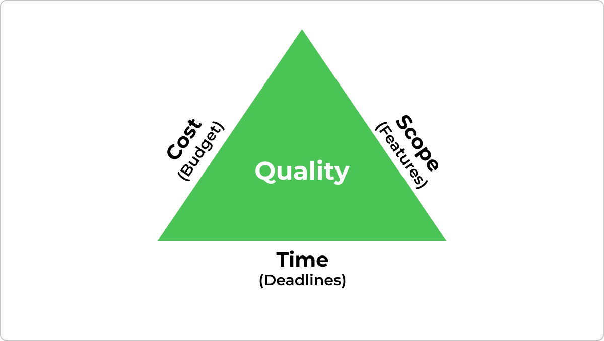
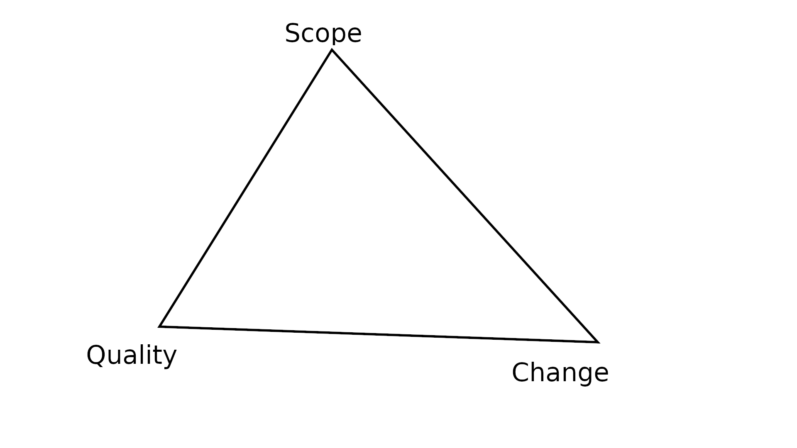

# PDF-Downloader
## Moving Targets

- Iron Triangle of Project Management
  - Plan vs Product
- Why?
  - Fixed Plan -> Expected Results
  - Moving Target -> Delays
- Modified Iron Triangle

-------------------------------------

-------------------------------------

## Plan vs Product 1

| Phase                  | Task                                                            | Effect | Circumst.         | Risk                    | Mitigation                                      | PP |
| ---------------------- | --------------------------------------------------------------- | ------ | ----------------- | ----------------------- | ----------------------------------------------- | -- |
| Planning               | Prioritize tasks in project                                     | –      | –                 | –                       | –                                               | 3  |
|                        | Write software requirements specification                       | –      | –                 | –                       | –                                               | 1  |
|                        | Document process for presentation                               | –      | –                 | –                       | –                                               | 1  |
|                        | Schedule project                                                | –      | –                 | –                       | –                                               | 2  |

-------------------------------------

| Phase                  | Task                                                            | Effect | Circumst.         | Risk                    | Mitigation                                      | PP |
| ---------------------- | --------------------------------------------------------------- | ------ | ----------------- | ----------------------- | ----------------------------------------------- | -- |
| MVP                    | Read Excel file                                                 | Urgent | –                 | More work than expected | AI suggestion                                   | 2  |
|                        | Copy file to work doc Excel file                                | Urgent | –                 | –                       | –                                               | 2  |
|                        | Download PDFs                                                   | Urgent | No exp scraping   | More work than expected | AI suggestion                                   | 2  |
|                        | Mark downloaded PDFs as such in work doc                        | Urgent | –                 | –                       | –                                               | 3  |

-------------------------------------

| Phase                  | Task                                                            | Effect | Circumst.         | Risk                    | Mitigation                                      | PP |
| ---------------------- | --------------------------------------------------------------- | ------ | ----------------- | ----------------------- | ----------------------------------------------- | -- |
|                        | Logging                                                         | Solid  | Recent exp        | –                       | –                                               | 2  |
|                        | Testing                                                         | Solid  | Recent exp        | –                       | –                                               | 2  |
|                        | Software user guide in README                                   | Urgent | –                 | –                       | –                                               | 2  |

-------------------------------------

| Phase                  | Task                                                            | Effect | Circumst.         | Risk                    | Mitigation                                      | PP |
| ---------------------- | --------------------------------------------------------------- | ------ | ----------------- | ----------------------- | ----------------------------------------------- | -- |
| Possible Nice‑to‑haves | Support reading work‑doc as well                                | –      | –                 | –                       | –                                               | 1  |
|                        | Assume work‑doc has been modified by user as new input          | –      | –                 | –                       | –                                               | 1  |
|                        | Only download un‑downloaded PDFs                                | –      | –                 | –                       | –                                               | 1  |
|                        | Have meaningful error messages if downloads fail                | Solid  | –                 | –                       | –                                               | 2  |
|                        | Set meaningful download statuses in work doc                    | Solid  | –                 | –                       | –                                               | 1  |

-------------------------------------

| Phase                  | Task                                                            | Effect | Circumst.         | Risk                    | Mitigation                                      | PP |
| ---------------------- | --------------------------------------------------------------- | ------ | ----------------- | ----------------------- | ----------------------------------------------- | -- |
| Extended Nice‑to‑haves | Refactor script to present interface through Textual            | –      | No exp w/ Textual | Textual not good choice | Ignored; just one option                        | 8  |
|                        | Refactor script to support backend use through standardized API | Big    | Need to research  | Extensive work needed   | Ignored; still good prep for possible extension | 13 |

-------------------------------------

## Plan vs Product 2

  Date   | Activity
-------- | ------------------------------------------------------------------
Mon  2/3 | Prioritization, Requirements specification
Wed  4/3 | Documentation of process, Scheduling project, Implementation setup
Thu  5/3 | Accessing and manipulating excel files
Fri  6/3 | Downloading pdfs and marking in excel working document
Thu 12/3 | Test cases, debugging, documentation
Fri 13/3 | Writing of user guide and presentation text
... ../. | Creating overview diagram for software if time permits

-------------------------------------

## Why?

-------------------------------------

# PDF-Downloader
## Changing Priorities

- Move Size in the Iron Triangle
- Re-Prioritizing
- % Revised Plan
  - Wordle Plan Modifications
- Should have had: Prioties A -> Plan A, Priorities B -> Plan B

-------------------------------------

## Old Priorities

- Mon 2/3:
  - Scope 6, quality 4, changes 0 assumed from project brief; unverified
    - Proof-of-concept testing
    - Proof-of-concept logging
    - Practice structure
    - Practice linting
    - ad-hoc AI experiments
    - finishing project
    - conscious comparisons between estimation time and completion time

-------------------------------------

## New Priorities

- Thu 5/3:
  - Scope 2, quality 8, changes 4 assumed from recommendation in one-on-one by sparring partner
  - Scope 4, quality 6, changes 2 should be possible within remaining time frame; prioritizing as such
    - testing of core underlying components
    - logging
    - formalized interfaces to ensure loose coupling of components
    - architectural overview with package diagram showing interfaces
    - linted commits
    - code refactoring to conform to planned-for structure
    - project conventions document
    - semi-formalization of git working procedure; gitflow w local rebase over merge

-------------------------------------

## Results - Wordle

  Date   | Activity
-------- | ---------
Wed 18/2 | Research of frameworks and paradigms + Planning
Thu 19/2 | Software Requirements Specification + Rough Prototype + Test Setup
Fri 20/2 | Logging Setup + Implementation
Mon 23/2 | Implementation + ~~Winning Streak~~ *Presentation*
~~Wed 25/2~~ | ~~Time Limitation + Hotseating~~
~~Thu 26/2~~ | ~~Statistics~~
*Fri 27/2* | ~~Statistics + Buffer~~ *Presentation x 2* + *Installation Instructions*

-------------------------------------

# PDF-Downloader
## Results for the new set of priorities

- Revised Architecture Design
- Project Conventions
- Revised commit history
- New Git Workflow
- Restructure of repository branches

-------------------------------------

-------------------------------------

## Project Conventions

1. Plan
   1. Individual Planning
      - research if needed
      - create an outline of planned changes
      - create new or adjust existing diagrams and overviews
   2. Communicate
      - ask relevant developers/maintainers for feedback
      - adjust plans accordingly

-------------------------------------

3. Do
   1. Local implemtation
   2. Local testing
   3. Local documentation

-------------------------------------

4. Check
   1. Push to development branch
   2. Get feedback
   3. Adjust accordingly

-------------------------------------

5. Act
   1. Push to testing branch
   2. Correct errors if any
   3. Synchronize with regular contributors/maintainers for push to main branch

-------------------------------------

## Revised Git Workflow

### gitflow

- parallel branches with different requirements and allowances
- requires good coordination between developers
- resilient to rapid changes in priorities and resource capacities

### local rebase and squashing over local merges

- preserves history better

-------------------------------------

## Repository Restructure

- small ad-hoc feature branches: pushed to
- development: features pushed to when ready
- main: pulls from development
- support: hotfixes directly pushed to main

-------------------------------------

# PDF-Downloader
## Developer Choices

- AI
- Scrapy vs Requests
- Coding Style
- Typed vs Untyped Coding

-------------------------------------

- AI
  - Time-saver
    - Reformatting markdown-tables after editing
    - Researching new libraries and modules
  - Time-waster
    - Plausible but incorrect code: How to call scrapy from a python script while retaining logging settings
    - Plausible but incorrect guide: Where are the commits for a repository found on github (two AIs, one github's own)

-------------------------------------

- Scrapy vs Requests
  - Requests
    - Straightforward
    - Limited features
  - Scrapy
    - Webscraping overkill for project
    - Potentially useful error handling
    - Efficient wrt bulk downloads
    - Experience
      - Module opinionated wrt logging
      - Documentation claims otherwise
      - Likely doable but would require careful (time-intensive) investigation

-------------------------------------

- Coding Style
  - Iterative Prototyping
  - Bottom-Up
  - Top-Down
  - Critical Path
  - Compartmentalization

-------------------------------------

- Typed vs Untyped Coding
  - Risk vs Boilerplate
  - Meaning and Functional Programming
  - Readability
    - General types
    - Costumized types
  - Who checks when?
  
-------------------------------------
